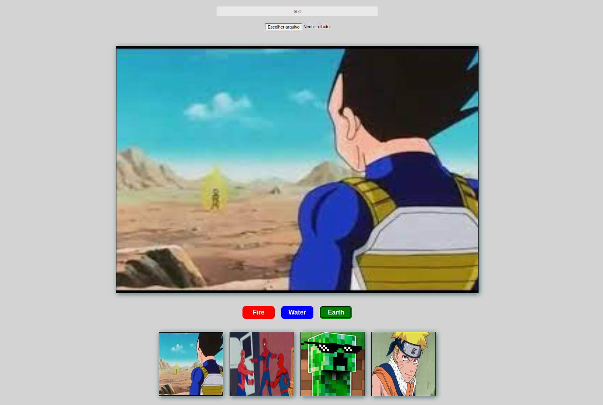

# project-meme-generator

## Sobre o Projeto

Projeto que realizei na [Trybe](https://github.com/tryber), ele tem como objetivo criar uma aplicação onde a pessoa usuária pode fazer upload de uma imagem e criar um meme com ela adicionando um texto. Esse projeto também tem como objetivo fixar os aprendizados sobre DOM além de proporcionar a busca de novos conhecimentos.

### Aprendisados
  1. Pegar o valor de um input do tipo file converter em URL e adicinar o arquivo na tela.

(<a href="#readme-top">back to top</a>)

## Construido Com
 1. **HTML**
 3. **CSS**
 4. **JavaScript**
 
 
(<a href="#readme-top">back to top</a>)

 
## Uso

A pessoa usuária pode adicionar uma imagem e adicionar um texto a ela ou pode selecionar uma imagem template disponível na aplicação, também é possível selecionar uma borda para o meme.

## Contato
Renan Fernandes - [Linkedin](https://www.linkedin.com/in/orenanfernandes/)

(<a href="#readme-top">back to top</a>)

